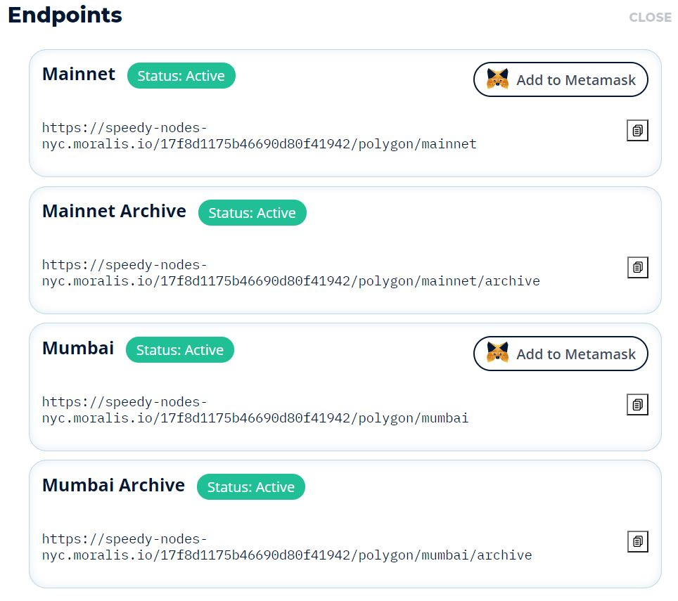
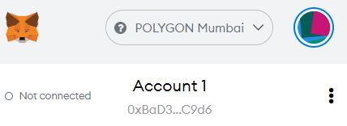

# LuneKey-Polygon

Programming language used - Solidity
Tools used - Remix, Moralis

1) Go to "https://chrome.google.com/webstore/detail/metamask/nkbihfbeogaeaoehlefnkodbefgpgknn" and add metamask extension
2) Go to "https://admin.moralis.io/login" and Login to your Moralis account
3) Go to speedy tabs and click on Polygon endpoints

 
 
4) Add your testnet/mainnet to your metamask

 
 
5) You will need to approve and you'll see a Testnet Polygon Mumbai is added to your Metamask
6) Same thing for mainnet too
7) Go to https://remix.ethereum.org/ and create a file Token.sol by right clicking on Contract folder

 
 
8) add content of Token.sol file to the code

 
 
10) Go to Compiler Tab and search for the same version of solidity that you used and click compile token

 

11) Go to "https://faucet.matic.network/" and copy your address on metamask. Submit and confirm. This is to send MATIC token to your metamask
 below is the address
 
 
 
 

 
12) Go to Deploy and Run Transaction Tab and Deploy the contract
 make sure the Contract is Token.sol that you want to deploy
 
 
 
13) A notification will appear on metamask which will ask you to approve the contract
make sure the gas fees is sufficient with the amount of Matic

14) 
